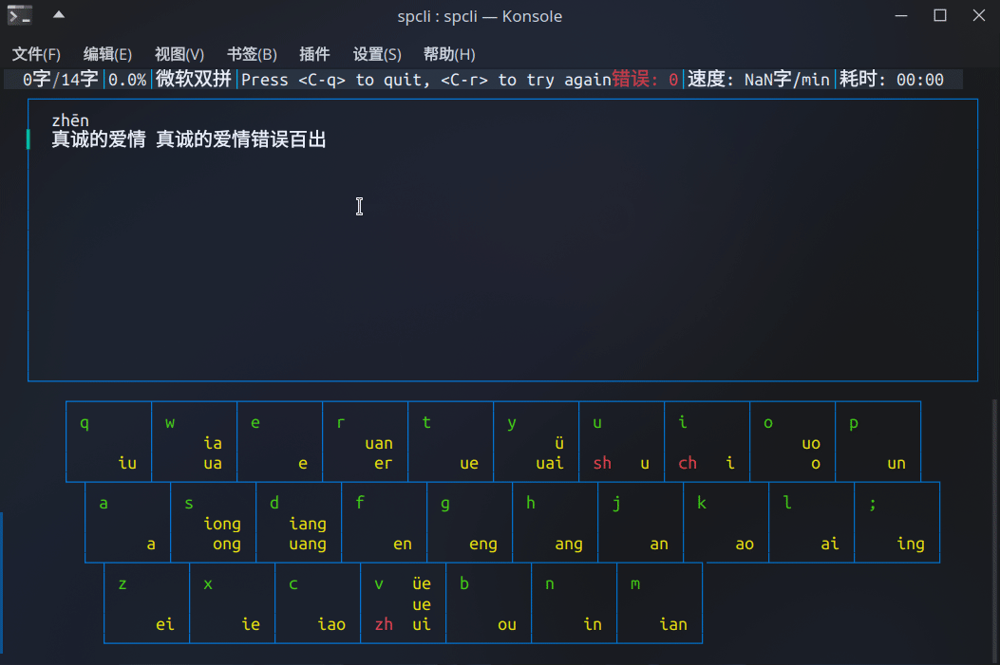
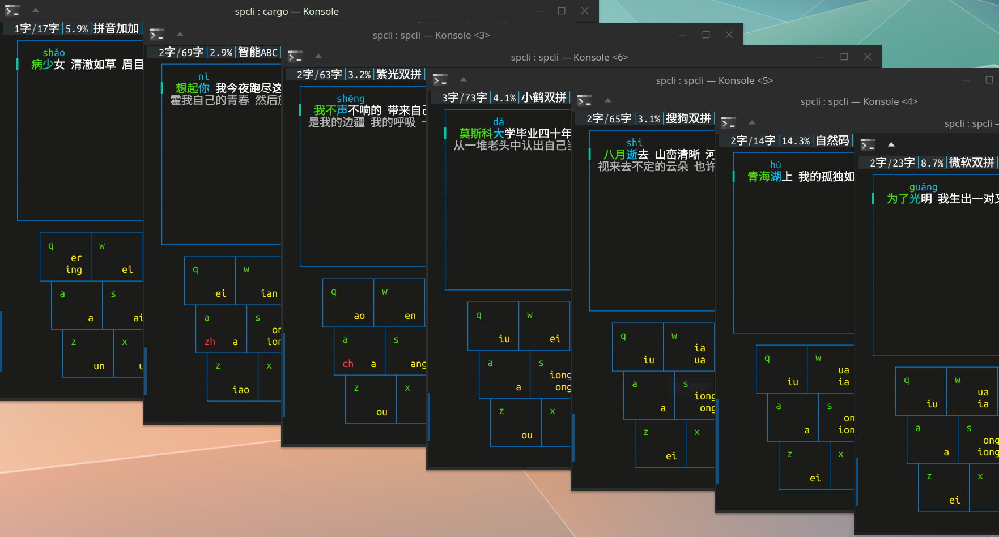

# SP-CLI

**S**<sub>huangpin</sub> **P**<sub>ractice</sub> **-** **C**<sub>ommand</sub> **L**<sub>ine</sub> **I**<sub>terface</sub>

在命令行中练习双拼



支持多种主流双拼方案



### USAGE:
```ps
spcli [OPTIONS]
```

### OPTIONS:
```ps
-h, --help               打印帮助信息
-k, --keymap <DIR>       键位路径 [default: ./keymap/ms]
-p, --pinyin <TYPE>      如何显示拼音 [default: live] [possible values: always, live, off]
-t, --text <DIR>         文本路径 [default: ./text/text.txt]
-V, --version            打印版本信息
```
### 自定义
#### 键位
> 可能不支持小众双拼方案
```yaml
# name : 双拼方案名
name      : 微软双拼
# 音节 : 键
iu        : q
# 一个音节对应多个键
ue        : tv
# 零声母
# 使用 O 键作为零声母
# [leader] + [韵母键] => 单韵母
# eg. [o] + [h:ang] => ang
leader    : o
# 零声母
# 使用韵母部分第一个字母作为双拼的第一个键
# eg. [a] + [h:ang] => ang
leader    : *
# [leader] + [leader_er] => er
# eg. [o] + [r] => er
leader_er :	r
# 启用 [e] + [r] => er
# 对于存在 [e] => e 和 [r] => r 的方案
split_er  :	1
# 禁用 [e] + [r] => er
split_er  :	0
```

#### 文本
使用`\n\n`分割多个段落
```
双拼（也称双打）是一种建立在拼音输入法基础上的输入方法，可视为全拼的一种改进。

它通过将汉语拼音中每个含多个字母的声母或韵母各自映射到某个按键上，使得每个音都可以用两个按键打出。

这种声母或韵母到按键的对应表通常称之为双拼方案，这种方案不是固定的，流行的大多数拼音输入法都支持双拼，并且有各自不同的方案，还允许用户自定义方案。
```


### 文本来源
> 著作权归作者所有
1. [知乎@chen](https://www.zhihu.com/people/chen-64-37-83) - [~~🌐~~](https://zhuanlan.zhihu.com/p/508468097)

2. [知乎@萧楚白](https://www.zhihu.com/people/xiao-chu-bai-46) - [🌐](https://zhuanlan.zhihu.com/p/517668467)

3. [知乎@叶峻峣](https://www.zhihu.com/people/L.M.Sherlock) - [🌐](https://zhuanlan.zhihu.com/p/559705516) 

4. [知乎@盐粒粒粒](https://www.zhihu.com/people/yan-li-13-94) - [🌐](https://www.zhihu.com/question/520140489/answer/2482497718)